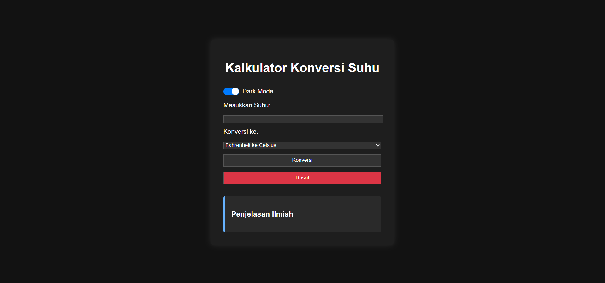

# 🌡️ Kalkulator Konversi Suhu (Temperature Converter)

Website interaktif untuk mengonversi suhu antara **Celsius** dan **Fahrenheit**, dibuat sebagai bagian dari mini project course **RevoU Fundamental Course Software Engineering**.

## 🚀 Fitur Utama

- 🔁 Konversi suhu dua arah: Celsius ↔ Fahrenheit
- 🧠 Penjelasan ilmiah dari proses konversi
- ✅ Validasi input suhu
- 🌗 Dark mode (mode terang/gelap)
- 🔄 Tombol Reset input dan hasil
- 🎨 Animasi transisi saat menampilkan hasil
- 📱 Desain responsive — tampil baik di layar HP
- 🧾 Struktur folder terorganisir (HTML, CSS, JS terpisah)

## 📸 Cuplikan Layar

 
## 📂 Struktur Proyek


## 📐 Teknologi Digunakan

- HTML5
- CSS3 (dengan media query responsive & animasi)
- JavaScript
- Git & GitHub Pages

## 🔧 Cara Menjalankan

1. Clone repository:
   ```bash
   git clone https://github.com/revou-fundamental-course/19-may-25-RizqiJagad
